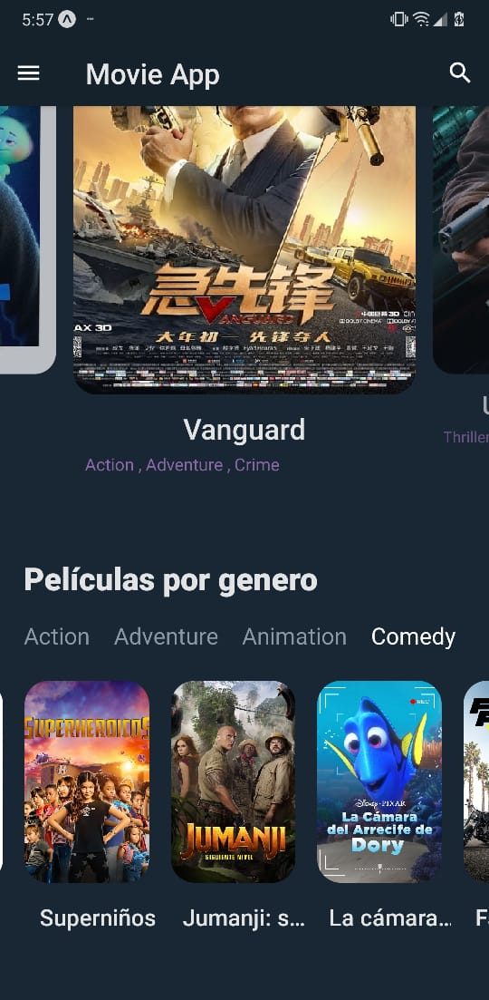
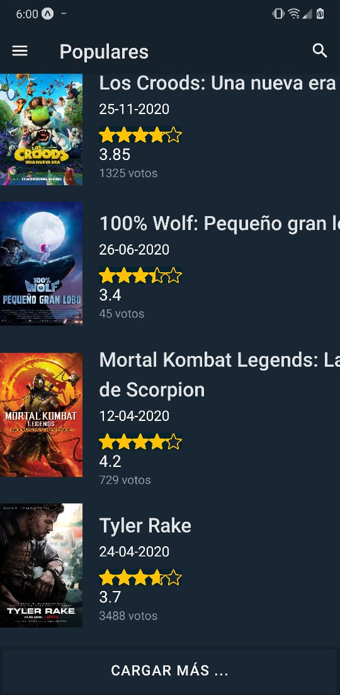
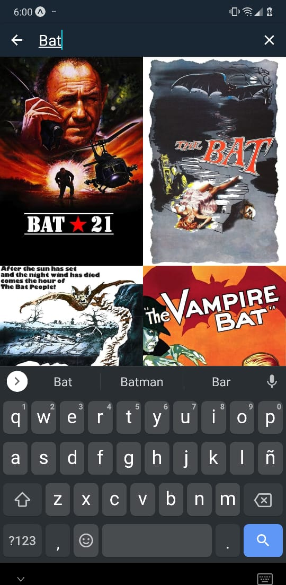
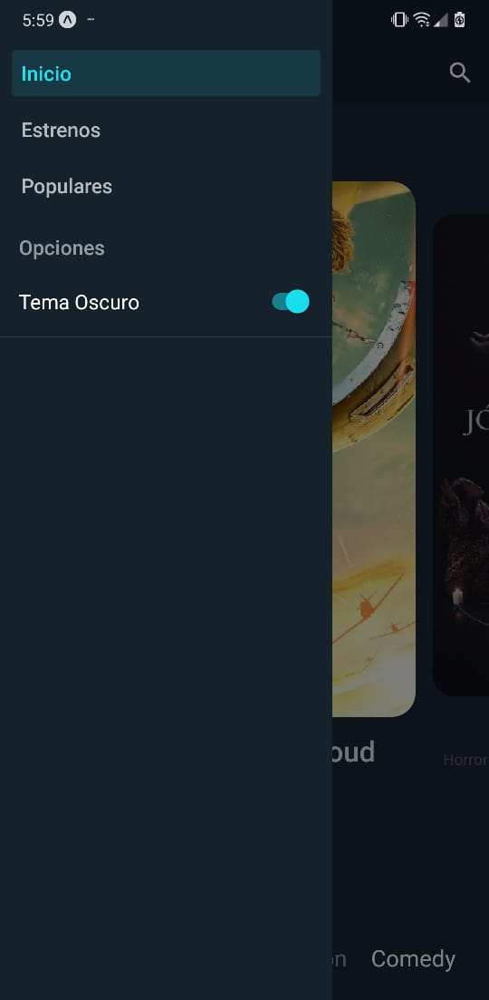

# App buscador de películas!

## Este es un proyecto de ejemplo utilizando principios básicos de desarrollo móvil con expo y elementos de react-native

## consume una api de TheMovieDB (https://developers.themoviedb.org/3)
## Configuracion: React Navigation 5 (https://reactnavigation.org/docs/getting-started/)
##

Snaps:

1. Home:

2. Genres movies:

3. Light theme:

4. Popular:

5. Busqueda:

6. Side bar:

E.O
