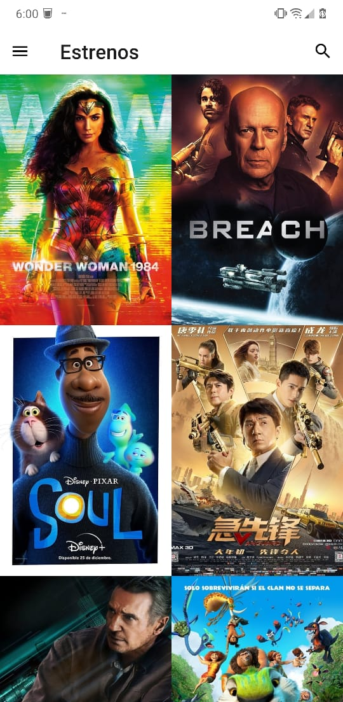

# App buscador de películas!

## Este es un proyecto de ejemplo utilizando principios básicos de desarrollo móvil con expo y elementos de react-native

## consume una api de TheMovieDB (https://developers.themoviedb.org/3)
## Configuracion: 
 - Router: React Navigation 5 (https://reactnavigation.org/docs/getting-started/)
 - Style: react-native-paper && react-native-snap-carousel

Snaps:

1. Home:

2. Genres movies:

3. Trailer Screen!:

4. Light theme:

5. Popular:

6. Busqueda:

7. Side bar:

E.O
